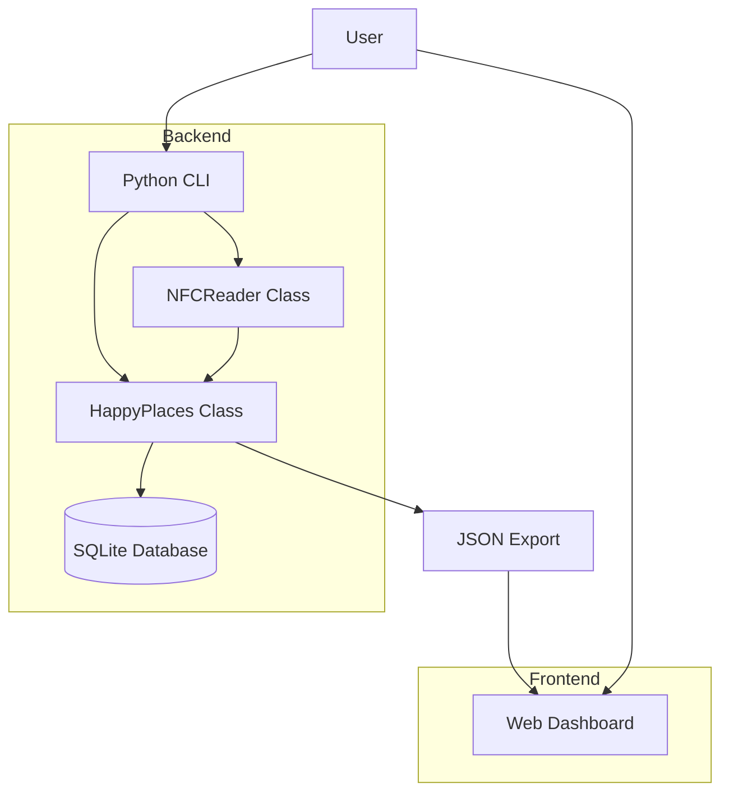
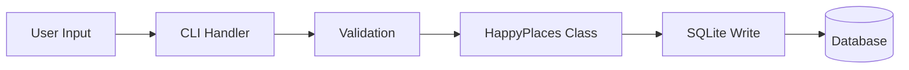
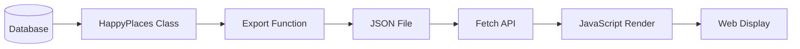
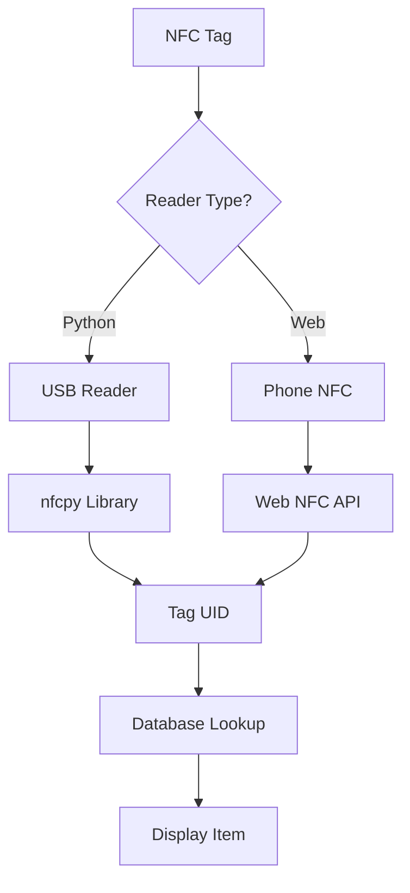
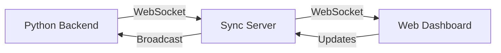
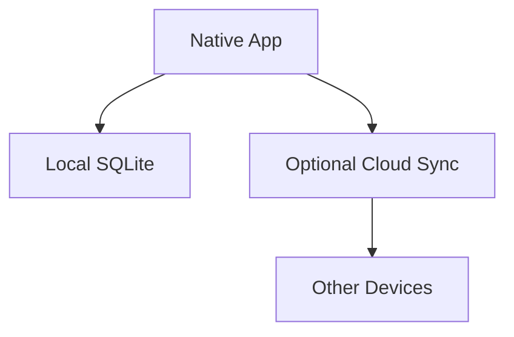

# System Patterns

## Architecture Overview

Happy Places follows a **decoupled, offline-first architecture** with clear separation between backend (Python) and frontend (web):



### Core Principles
1. **Backend/Frontend Decoupling**: Python handles data, web handles visualization
2. **Offline-First**: No server required, all data local
3. **Static-Deployable**: Frontend is pure HTML/CSS/JS (GitHub Pages ready)
4. **Data Portability**: JSON export/import for migration
5. **Graceful Degradation**: Features work without advanced hardware (NFC optional)

## Design Patterns

### 1. Repository Pattern (HappyPlaces Class)
**When**: All database operations
**Why**: Single source of truth for data access, encapsulates SQLite complexity

```python
class HappyPlaces:
    def __init__(self, db_path='happy_places.db'):
        self.db_path = db_path
        self._init_db()
    
    # Item operations
    def add_item(self, name, category, **kwargs)
    def update_item(self, item_id, **updates)
    def delete_item(self, item_id)
    def get_item(self, item_id)
    def list_items(self)
    
    # Placement operations
    def record_placement(self, item_id, zone_name, distribution_type, ...)
    def get_placement_history(self, item_id)
    
    # Zone operations
    def add_zone(self, name, description)
    def list_zones(self)
    
    # Analysis operations
    def get_distribution_patterns(self)
    def get_routine_insights(self)
    def items_needing_attention(self)
```

### 2. Adapter Pattern (NFCReader Class)
**When**: Hardware integration (NFC readers)
**Why**: Abstracts hardware complexity, handles unavailable hardware gracefully

```python
class NFCReader:
    def __init__(self):
        self.available = self._check_hardware()
    
    def _check_hardware(self):
        # Detect nfcpy and USB reader
        # Return True if available, False otherwise
    
    def scan_tag(self):
        # Return tag UID or None if unavailable
```

### 3. Command Pattern (CLI Interface)
**When**: User-facing commands
**Why**: Clean separation of concerns, easy to extend

```python
def main():
    command = sys.argv[1] if len(sys.argv) > 1 else 'help'
    
    if command == 'add':
        handle_add()
    elif command == 'list':
        handle_list()
    # ... etc
```

### 4. Factory Pattern (Item Creation)
**When**: Creating items with different categories
**Why**: Different categories have different required fields

```python
def add_item(self, name, category, **kwargs):
    if category == 'good_stuff':
        # Requires: purchase_date, expected_lifespan_days
    elif category == 'refillable':
        # Requires: quantity_current, refill_threshold, unit
    elif category == 'disposable':
        # Minimal fields
```

### 5. Export/Import Pattern (Data Portability)
**When**: Moving data between systems
**Why**: User data ownership, visualization layer needs static JSON

```python
def export_to_json(self, output_file='happy_places_export.json'):
    data = {
        'items': self.list_items(),
        'placements': self._get_all_placements(),
        'zones': self.list_zones(),
        'patterns': self.get_distribution_patterns(),
        'routines': self.get_routine_insights()
    }
    with open(output_file, 'w') as f:
        json.dump(data, f, indent=2)
```

## Code Organization

### Backend Structure (Happy-Places.py)
```
Happy-Places.py (1064 lines)
├── Imports & Constants (lines 1-20)
├── NFCReader Class (lines 21-100)
│   ├── Hardware detection
│   ├── Tag scanning
│   └── Error handling
├── HappyPlaces Class (lines 101-900)
│   ├── Database initialization
│   ├── Item CRUD operations
│   ├── Placement tracking
│   ├── Zone management
│   ├── Lifecycle calculations
│   ├── Pattern analysis
│   ├── Data export/import
│   └── Backup/restore
├── CLI Handlers (lines 901-1000)
│   ├── Interactive prompts
│   ├── Command routing
│   └── Output formatting
└── Main Entry Point (lines 1001-1064)
```

### Frontend Structure (index.html)
```
index.html (683 lines)
├── HTML Structure (lines 1-150)
│   ├── Tab navigation
│   ├── Dashboard section
│   ├── Items section
│   ├── Patterns section
│   ├── Zones section
│   └── Routines section
├── CSS Styles (lines 151-350)
│   ├── Layout (Grid/Flexbox)
│   ├── Color scheme
│   ├── Responsive design
│   └── Component styles
└── JavaScript (lines 351-683)
    ├── Data loading
    ├── Tab switching
    ├── Search/filter/sort
    ├── Rendering functions
    ├── Web NFC integration
    └── Event handlers
```

### Database Schema
```sql
-- Items table: Core item registry
CREATE TABLE items (
    id INTEGER PRIMARY KEY AUTOINCREMENT,
    nfc_tag_id TEXT UNIQUE,
    name TEXT NOT NULL,
    category TEXT NOT NULL,  -- good_stuff, refillable, disposable
    
    -- Lifecycle fields (good_stuff)
    purchase_date DATE,
    expected_lifespan_days INTEGER,
    
    -- Refill fields (refillable)
    quantity_current REAL,
    refill_threshold REAL,
    unit TEXT,
    
    -- Shared fields
    created_at TIMESTAMP DEFAULT CURRENT_TIMESTAMP,
    updated_at TIMESTAMP DEFAULT CURRENT_TIMESTAMP
);

-- Placements table: Spatial and behavioral tracking
CREATE TABLE placements (
    id INTEGER PRIMARY KEY AUTOINCREMENT,
    item_id INTEGER NOT NULL,
    zone_name TEXT NOT NULL,
    distribution_type TEXT,  -- placed, stack, spread, lose, discard
    routine TEXT,            -- morning_routine, night_routine, etc.
    motive TEXT,             -- reachability, comfort, fatigue, etc.
    co_present_items TEXT,   -- JSON array of item IDs
    timestamp TIMESTAMP DEFAULT CURRENT_TIMESTAMP,
    FOREIGN KEY (item_id) REFERENCES items(id) ON DELETE CASCADE
);

-- Zones table: Physical spaces
CREATE TABLE zones (
    id INTEGER PRIMARY KEY AUTOINCREMENT,
    name TEXT UNIQUE NOT NULL,
    description TEXT,
    created_at TIMESTAMP DEFAULT CURRENT_TIMESTAMP
);

-- Co-presence table: Item relationships
CREATE TABLE co_presence (
    id INTEGER PRIMARY KEY AUTOINCREMENT,
    item1_id INTEGER NOT NULL,
    item2_id INTEGER NOT NULL,
    frequency INTEGER DEFAULT 1,
    last_seen TIMESTAMP DEFAULT CURRENT_TIMESTAMP,
    FOREIGN KEY (item1_id) REFERENCES items(id) ON DELETE CASCADE,
    FOREIGN KEY (item2_id) REFERENCES items(id) ON DELETE CASCADE
);
```

## Data Flow

### Write Path: User → Database


### Read Path: Database → Web


### NFC Flow: Tag → Item


## Integration Patterns

### Python-to-Web Integration
- **Decoupled**: No direct connection
- **Static Export**: Python writes JSON, web reads JSON
- **Manual Refresh**: User runs `export` command when data changes
- **Benefit**: Simple deployment, no server needed

### NFC Integration (Dual Mode)

#### Python Hardware Mode
```python
reader = NFCReader()
if reader.available:
    tag_id = reader.scan_tag()
    hp.add_item(name, category, nfc_tag_id=tag_id)
else:
    print("NFC not available, manual entry")
```

#### Web Browser Mode (JavaScript)
```javascript
if ('NDEFReader' in window) {
    const reader = new NDEFReader();
    await reader.scan();
    reader.onreading = event => {
        const tagId = event.serialNumber;
        lookupItem(tagId);
    };
} else {
    // Hide NFC button
}
```

### Database Access Pattern
- **Single Connection**: One connection per operation (SQLite limitation)
- **Context Manager**: Always use `with` for transactions
- **CASCADE Delete**: Foreign keys maintain referential integrity

```python
def delete_item(self, item_id):
    with sqlite3.connect(self.db_path) as conn:
        cursor = conn.cursor()
        cursor.execute("DELETE FROM items WHERE id = ?", (item_id,))
        conn.commit()
        # Placements auto-deleted via CASCADE
```

## Security Considerations

### Local-Only Security
- **No authentication**: Single-user, local system
- **File permissions**: Rely on OS file permissions for database
- **Backup protection**: User responsible for securing backup files
- **NFC tag IDs**: Not encrypted (physical access required)

### Web Security
- **HTTPS for Web NFC**: Required by browser (except localhost)
- **No XSS risk**: Static HTML, no user-generated content in DOM
- **CORS**: Not applicable (same-origin)
- **CSP**: Could be added for additional hardening

### Data Privacy
- **Local storage**: No data transmitted to servers
- **User control**: Complete ownership of data
- **Export security**: JSON files contain all data (protect accordingly)

## Lifecycle Calculations

### Health Percentage (good_stuff)
```python
def calculate_health(purchase_date, expected_lifespan_days):
    days_old = (datetime.now().date() - purchase_date).days
    days_remaining = expected_lifespan_days - days_old
    health_percent = (days_remaining / expected_lifespan_days) * 100
    return max(0, health_percent)  # Never negative
```

### Refill Status (refillable)
```python
def needs_refill(quantity_current, refill_threshold):
    return quantity_current <= refill_threshold

def estimate_days_until_refill(quantity_current, refill_threshold, usage_rate):
    if usage_rate <= 0:
        return None
    quantity_until_threshold = quantity_current - refill_threshold
    return quantity_until_threshold / usage_rate
```

### Usage Rate Calculation
```python
def calculate_usage_rate(item_id):
    # Get all quantity updates from history
    updates = get_update_history(item_id)
    if len(updates) < 2:
        return 0
    
    # Calculate rate from first to last update
    days_elapsed = (updates[-1].date - updates[0].date).days
    quantity_change = updates[0].quantity - updates[-1].quantity
    
    return quantity_change / days_elapsed if days_elapsed > 0 else 0
```

## Pattern Recognition

### Distribution Analysis
```python
def get_distribution_patterns(self):
    # Count by distribution_type
    types = ['placed', 'stack', 'spread', 'lose', 'discard']
    counts = {t: count_placements_by_type(t) for t in types}
    
    # Group by zone
    by_zone = group_by(placements, 'zone_name')
    
    return {'by_type': counts, 'by_zone': by_zone}
```

### Routine Analysis
```python
def get_routine_insights(self):
    # Aggregate by routine
    routines = {}
    for placement in all_placements:
        routine = placement['routine']
        if routine not in routines:
            routines[routine] = {
                'count': 0,
                'zones': set(),
                'motives': set(),
                'items': set()
            }
        routines[routine]['count'] += 1
        routines[routine]['zones'].add(placement['zone_name'])
        routines[routine]['motives'].add(placement['motive'])
        routines[routine]['items'].add(placement['item_id'])
    
    return routines
```

## Error Handling Patterns

### Graceful Degradation
```python
# NFC unavailable → Manual entry
# Database locked → Retry with exponential backoff
# Invalid input → Prompt for correction
# Missing dependencies → Feature disabled with warning
```

### User-Facing Errors
```python
try:
    item = hp.get_item(item_id)
except ItemNotFound:
    print(f"Item {item_id} not found")
    sys.exit(1)
```

### Silent Failures (Appropriate Cases)
```python
# Web NFC unsupported → Hide button, don't throw error
# JSON export missing → Show message in dashboard
# Demo data already exists → Skip creation
```

## Testing Strategy

### Manual Testing Focus
- CLI commands with various inputs
- Database operations (create, read, update, delete)
- Export/import round-trip
- Backup/restore functionality
- NFC scanning (when hardware available)
- Web dashboard interactions

### Test Data
- Demo data generator provides realistic test cases
- Multiple item categories
- Various distribution patterns
- Historical placements

### Edge Cases to Consider
- Empty database
- Items with no placements
- Zones with no items
- Expired/depleted items
- Very old items (date edge cases)
- Large quantities (number precision)

## Performance Considerations

### Database Optimization
- **Indexes**: On frequently queried fields (item_id, zone_name, routine)
- **Denormalization**: Co-presence tracked separately for speed
- **Query limits**: Not needed (personal use = < 1000 items typical)

### Frontend Performance
- **Client-side filtering**: Fast for small datasets
- **Debounced search**: Reduce re-renders during typing
- **Lazy rendering**: Could implement for large item lists (future)

### File Operations
- **JSON export**: O(n) complexity, fast for personal scale
- **Backup**: File copy operation, instant for SQLite size

## Future Pattern Opportunities

### Real-time Sync Pattern (If Needed)


### Mobile Native Pattern (If Built)


### Plugin Architecture (If Extended)
```python
class Plugin:
    def on_item_added(self, item): pass
    def on_placement_recorded(self, placement): pass

# Could enable: notifications, integrations, analytics
```

## Coding Standards

### Python Style
- PEP 8 compliant
- Descriptive variable names
- Docstrings for public methods
- Type hints where beneficial
- Context managers for resources

### JavaScript Style
- ES6+ features (const/let, arrow functions, template literals)
- Functional where possible
- Clear function names
- Comments for complex logic
- No global namespace pollution

### SQL Style
- Uppercase keywords
- Clear table/column names
- Foreign keys always defined
- Indexes on join columns
- CASCADE deletes where appropriate

### Documentation
- README for project overview
- ARCHITECTURE for technical details
- QUICKSTART for immediate usage
- Inline comments for complex logic
- Command help text for all CLI operations
